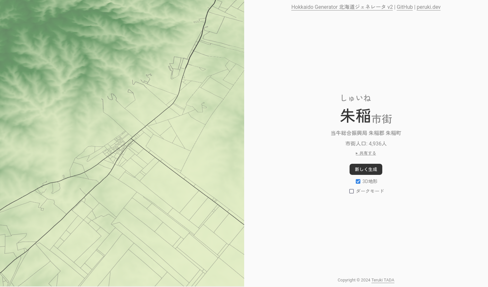
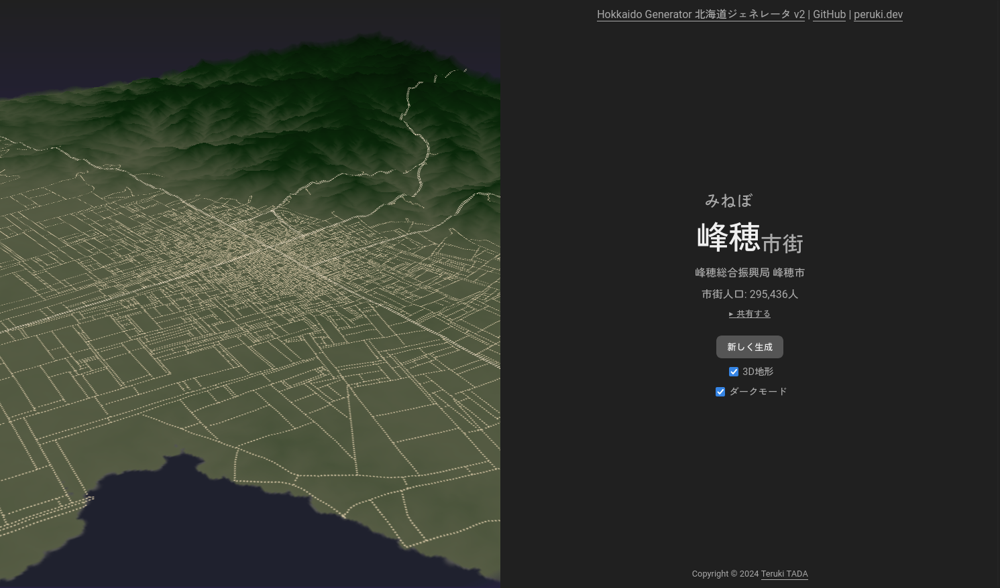

# Hokkaido Generator - 北海道ジェネレータ - v2

Website: **[v2hokkaidogenerator.peruki.dev/](https://v2hokkaidogenerator.peruki.dev/)**

実在しない北海道の市街を自動生成します。

## プレビュー


[Seed: 545903](https://v2hokkaidogenerator.peruki.dev/?seed=545903)


[Seed: 262905](https://v2hokkaidogenerator.peruki.dev/?seed=262905)

## ビルド方法

```
$ cd frontend
$ bun i
$ bun run dev
```

シミュレータ部分の更新は以下のコマンドで行います。

```
$ cd generator
$ make
```

## 技術構成

Rustで開発したシミュレータをWebAssemblyビルドし、TypeScript側で表示する形式です。

### フロントエンド

言語: TypeScript <br>
開発環境: Svelte + SvelteKit <br>

地図の表示にはMaplibre GL JSを利用しています。

## 手法構成

- **区画・交通網生成: 拡張L-system (に由来する生成アルゴリズム)**<br>
Parish and Müller (2001) [^pm]を実装しています。
[Sean Barrett のブログ記事](http://nothings.org/gamedev/l_systems.html)、
[phireskyの資料](https://phiresky.github.io/procedural-cities/) を実装の参考としています。<br>
source: https://github.com/TadaTeruki/street-engine/

[^pm]: Parish, Y. I., & Müller, P. (2001). Procedural modeling of cities. Proceedings of the 28th Annual Conference on Computer Graphics and Interactive Techniques, 301–308.

- **地名生成: マルコフ連鎖**<br>
発音の繋がりで地名を組み上げる独自実装です。<br>
source: https://github.com/TadaTeruki/name-engine/

- **地形生成: Landscape Evolution Model**<br>
Steer (2021) [^analytical] と Cordonnier et al. (2016) [^large]を参考に実装しています。<br>
source: https://github.com/TadaTeruki/fastlem/

[^analytical]: Steer, P. (2021). Analytical models for 2D landscape evolution. Earth Surface Dynamics Discussions, 2021, 1-17.

[^large]: Cordonnier, G., Braun, J., Cani, M.-P., Benes, B., Galin, É., Peytavie, A., & Guérin, É. (2016). Large scale terrain generation from tectonic uplift and fluvial erosion. Computer Graphics Forum, 35(2), 165–175.

## 地名データセットについて

[CSV file](./frontend/static/dataset/placenames.csv)

地名の生成にあたり用いるデータセットは、『北海道の地名』[^1] を参考としています。

[^1]: 山田秀三. (2000). 北海道の地名. 草風館.

## ライセンス

MPL-2.0

Copyright 2024 Teruki TADA
